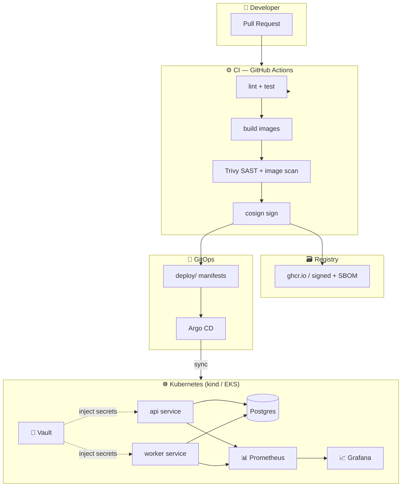

# devsecops-platform 🚩

A GitOps-driven, security-hardened Kubernetes platform deploying a real multi-service app — provisioned by **Terraform**, deployed by **Argo CD**, secured by **Vault** + **Trivy**, observed by **Prometheus/Grafana** with an SLO.

This is the flagship: the repo that proves I can design, ship, secure, run, and observe software the way a platform-security team does.

[](https://github.com/mohidev-tech/devsecops-platform/actions/workflows/ci.yml)
[](LICENSE)

## 💸 Cost story (read this first)

**This entire platform runs on your laptop for $0** via `kind` + Docker. The cloud variant is a single, fully-Terraformed short-lived environment: `terraform apply` → screenshot dashboards → `terraform destroy`. Total cloud spend across the build of this portfolio: **under $5**.

That's not a limitation — it's the design. A "local-first, cloud-fluent" platform is what most companies actually want.

## Architecture



## What this proves

| Capability | How |
|---|---|
| **IaC + reproducibility** | Terraform brings up the local cluster (`kind` provider) and the cloud variant (EKS) from the same root module pattern |
| **GitOps delivery** | Argo CD watches `deploy/argocd/` — merge to `main` ↦ auto-sync ↦ live cluster |
| **Secrets management** | Vault sidecar injection; no secrets in env, manifests, or images |
| **Supply chain** | Trivy gates the build; images signed with cosign keyless OIDC; SBOM attached |
| **Runtime hardening** | Distroless nonroot images, read-only root FS, dropped capabilities, NetworkPolicy default-deny |
| **Observability + SLO** | Prometheus scrapes both services; Grafana dashboard; one documented SLO with burn-rate alerts |
| **Autoscaling** | HPA on the api service driven by request-rate metric |

## Repo layout

```
services/                Two Go services (api + worker) sharing a Postgres
deploy/
  helm/                  Charts for api, worker, supporting infra
  argocd/                Argo CD Application + AppProject manifests
  kind/                  kind cluster config + bring-up scripts
infra/
  terraform/local/       Local cluster provisioning (kind provider)
  terraform/cloud/       EKS variant — apply briefly, then destroy
observability/
  prometheus/            Scrape configs, recording + alerting rules
  grafana/dashboards/    SLO dashboard JSON
security/
  vault/                 Vault config, policies, K8s auth setup
  policies/              OPA/Gatekeeper admission policies
docs/                    Architecture decision records, runbooks
.github/workflows/       CI: lint, test, build, scan, sign
```

## Quickstart (local)

```bash
# Phase 1: bring up cluster + deploy app
make cluster        # creates kind cluster, installs ingress
make deploy         # helm install api, worker, postgres
make smoke          # curl the api, verify worker drained queue

# Phase 2: layer on security + GitOps + observability
make argocd         # bootstrap Argo CD, hand off deploy/ to it
make vault          # bring up Vault, configure K8s auth, rotate app to use it
make observe        # Prometheus + Grafana, open SLO dashboard

# Tear down
make destroy
```

## Roadmap (phased, per portfolio plan)

- [x] Phase 1a — Scaffold: services, Helm, kind, Terraform local
- [x] Phase 1b — Functional: api persists jobs to Postgres, worker drains via `FOR UPDATE SKIP LOCKED`, `make deploy && make smoke` is green
- [ ] Phase 1c — Cloud variant: one short-lived `apply → screenshot → destroy` cycle
- [ ] Phase 2 — Security & GitOps: Argo CD bootstrap, Vault sidecar injection (replaces plaintext DB creds), Trivy admission policy, Prometheus + SLO dashboard
- [ ] Stretch — Chaos lab, canary deploys, AI-powered risk scoring on scan results

See [docs/adr/](docs/adr/) for architecture decisions.

## License

Apache 2.0 — see [LICENSE](LICENSE).
