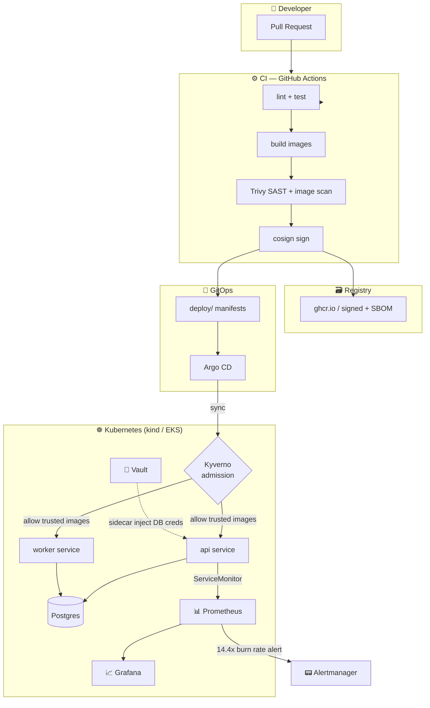

# devsecops-platform 🚩

A GitOps-driven, security-hardened Kubernetes platform deploying a real multi-service app — provisioned by **Terraform**, deployed by **Argo CD**, secured by **Vault** + **Trivy**, observed by **Prometheus/Grafana** with an SLO.

This is the flagship: the repo that proves I can design, ship, secure, run, and observe software the way a platform-security team does.

[](https://github.com/mohidev-tech/devsecops-platform/actions/workflows/ci.yml)
[](LICENSE)

## 💸 Cost story (read this first)

**This entire platform runs on your laptop for $0** via `kind` + Docker. The cloud variant is a single, fully-Terraformed short-lived environment: `terraform apply` → screenshot dashboards → `terraform destroy`. Total cloud spend across the build of this portfolio: **under $5**.

That's not a limitation — it's the design. A "local-first, cloud-fluent" platform is what most companies actually want.

## Architecture



## What this proves

| Capability | How |
|---|---|
| **IaC + reproducibility** | Terraform brings up the local cluster (`kind` provider) and the cloud variant (EKS) from the same root module pattern |
| **GitOps delivery** | Argo CD watches `deploy/argocd/` — merge to `main` ↦ auto-sync ↦ live cluster |
| **Secrets management** | Vault sidecar injection; no secrets in env, manifests, or images |
| **Supply chain** | Trivy gates the build; images signed with cosign keyless OIDC; SBOM attached |
| **Runtime hardening** | Distroless nonroot images, read-only root FS, dropped capabilities, NetworkPolicy default-deny |
| **Observability + SLO** | Prometheus scrapes both services; Grafana dashboard; one documented SLO with burn-rate alerts |
| **Autoscaling** | HPA on the api service driven by request-rate metric |

## Repo layout

```
services/                Two Go services (api + worker) sharing a Postgres
deploy/
  helm/                  Charts for api, worker, supporting infra
  argocd/                Argo CD Application + AppProject manifests
  kind/                  kind cluster config + bring-up scripts
infra/
  terraform/local/       Local cluster provisioning (kind provider)
  terraform/cloud/       EKS variant — apply briefly, then destroy
observability/
  prometheus/            Scrape configs, recording + alerting rules
  grafana/dashboards/    SLO dashboard JSON
security/
  vault/                 Vault config, policies, K8s auth setup
  policies/              OPA/Gatekeeper admission policies
docs/                    Architecture decision records, runbooks
.github/workflows/       CI: lint, test, build, scan, sign
```

## Quickstart (local)

```bash
# Minimum viable: app comes up and processes jobs
make cluster        # 3-node kind cluster
make deploy         # build images, install postgres + api + worker
make smoke          # post 5 jobs, assert worker drained them

# OR: full secure-mode bring-up (everything below in one target)
make secure-mode
```

Secure-mode layers on, in order:

```bash
make policies          # Kyverno admission policies (trusted registry, resource limits)
make vault-bootstrap   # Vault dev mode + k8s auth + api policy + swap api to vault-injected creds
make observe           # kube-prometheus-stack + ServiceMonitor + PrometheusRule + SLO dashboard
make argocd            # Argo CD with app-of-apps; merge-to-main now deploys
```

```bash
make destroy           # tear down the kind cluster
```

## Cloud variant — one-time demo

```bash
cd infra/terraform/cloud
terraform apply -auto-approve     # ~10 min, ~$0.15/hour
make deploy && make smoke          # same Helm charts on EKS
terraform destroy -auto-approve   # ALWAYS run this when done
```

See [infra/terraform/cloud/README.md](infra/terraform/cloud/README.md) for the full cost breakdown.

## Roadmap

- [x] **Phase 1a** — Scaffold: services, Helm, kind, Terraform local
- [x] **Phase 1b** — Functional: api persists jobs to Postgres, worker drains via `FOR UPDATE SKIP LOCKED`, `make deploy && make smoke` is green
- [x] **Phase 1c** — Cloud variant: EKS via Terraform with public-subnet/SPOT cost discipline
- [x] **Phase 2a** — Vault sidecar injection replaces plaintext DB creds (ADR 0004)
- [x] **Phase 2b** — Kyverno admission policies: trusted-registry + require-resources
- [x] **Phase 2c** — Argo CD app-of-apps wiring `deploy/argocd/apps/*`
- [x] **Phase 2d** — kube-prometheus-stack + ServiceMonitor + 14.4x burn-rate alert + Grafana SLO dashboard
- [ ] **Phase 3 (satellite)** — `secure-supply-chain`: cosign-signed images, SBOM at release, admission verification
- [ ] **Stretch** — Chaos lab, canary deploys, AI risk scoring on scan results

See [docs/adr/](docs/adr/) for architecture decisions.

## License

Apache 2.0 — see [LICENSE](LICENSE).
